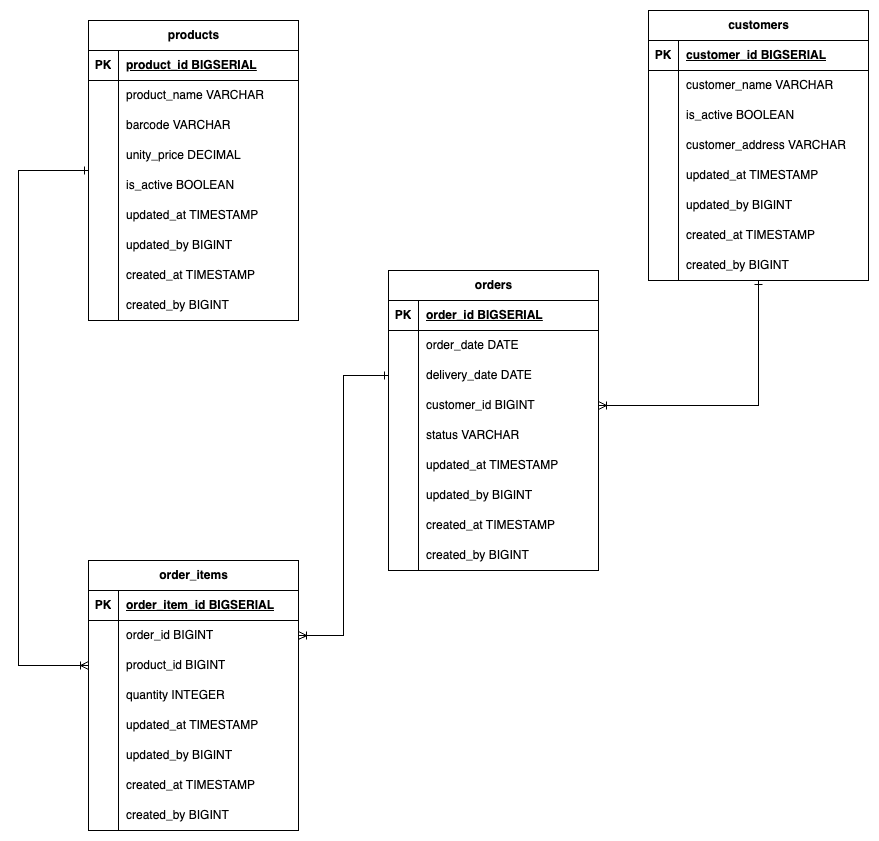

## Data Engineering Take-Home Task

### Welcome

Welcome to Deel's Data Engineering Take-Home task, as mentioned in the Task specification document, this is the pre-built stack that will help you on your solution development. This repository contains a pre-configured database containing the database represented by the following DER:

### Database Configuration

Once you have [Docker](https://www.docker.com/products/docker-desktop/) and [docker-compose](https://docs.docker.com/compose/install/) configured in your computer, with your Docker engine running, you must execute the following command provision the source database:

> docker-compose up

:warning:**Important**: Before running this command make sure you're in the root folder of the project.

Once you have the Database up and running feel free to connect to this using any tool you want, for this you can use the following credentials:

- **Username**: `finance_db_user`
- **Password**: `1234`
- **Database**: `finance_db`

If you opt-in to use CDC tools, we have the following pre-set configurations in the DB:

- **CDC Username**: `cdc_user`
- **CDC User Password**: `cdc_1234`
- **Database**: `finance_db`
- **Replication Slot**: `cdc_pgoutput`
- **Publication Name**: `cdc_publication`

Extra informations and tips about the task execution can be found in the task description document shared by our recruiting team.

For any questions, feel free to reach us out through data-platform@deel.com 
