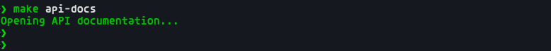

## Data Engineering Take-Home Task

### Welcome

Welcome to Deel's Data Engineering Take-Home task, as mentioned in the Task specification document, this is the pre-built stack that will help you on your solution development. This repository contains a pre-configured database containing the database represented by the following DER:


### Database Configuration

Once you have [Docker](https://www.docker.com/products/docker-desktop/) and [docker-compose](https://docs.docker.com/compose/install/) configured in your computer, with your Docker engine running, you must execute the following command provision the source database:


> docker-compose up


:warning:**Important**: Before running this command make sure you're in the root folder of the project.

Once you have the Database up and running feel free to connect to this using any tool you want, for this you can use the following credentials:

- **Username**: `finance_db_user`
- **Password**: `1234`
- **Database**: `finance_db`

If you opt-in to use CDC tools, we have the following pre-set configurations in the DB:

- **CDC Username**: `cdc_user`
- **CDC User Password**: `cdc_1234`
- **Database**: `finance_db`
- **Replication Slot**: `cdc_pgoutput`
- **Publication Name**: `cdc_publication`

### Spark CDC Pipeline

This project includes a Spark streaming application that captures changes from the source PostgreSQL database and loads them into a target analytics database with historical versioning.

#### Architecture

- **Source PostgreSQL Database**: Contains operational data (customers, products, orders, etc.)
- **Debezium + Kafka**: Captures change events from PostgreSQL using CDC
- **Spark Streaming Application**: Processes the change events and writes to the target database
- **Target PostgreSQL Database**: Stores historical data with time-travel capabilities
- **Analytics API**: Provides RESTful endpoints for accessing analytical data

#### Historical Data Schema

The target analytics database follows a historized schema design:
- Every table has a corresponding `*_history` table (e.g., `customers_history`)
- History tables include additional columns:
  - `valid_from`: Timestamp when the record became valid
  - `valid_to`: Timestamp when the record became invalid (NULL for current records)
  - `is_current`: Boolean flag indicating if this is the current version
  - `operation_type`: The operation that created this record (INSERT, UPDATE, DELETE)

This design allows for:
- Point-in-time queries
- Tracking the full history of each record
- Differentiating between soft-deletes and hard-deletes
- Analytics across time periods

#### Running the Pipeline

You can use the provided Makefile for easy management of the pipeline:

```bash
# Start all services
make start

# Configure Debezium connector
make configure

# Check service status
make status

# View logs
make logs
make logs-spark
make logs-debezium
make logs-api

# Run analytics queries
make analytics

# Query the analytical views (automatically updated)
make query-views

# Open API documentation in browser
make api-docs

# Stop all services
make stop

# Restart all services (with fresh target database)
make restart

# Clean up everything
make clean
```

For a full list of available commands:

```bash
make help
```

Alternatively, you can run the individual commands:

1. Start all services:

```bash
docker-compose up -d
```

2. Configure Debezium connector to capture changes from PostgreSQL:

```bash
./configure-debezium.sh
```

3. The Spark application will automatically start processing the CDC events.

4. Monitor the logs:

```bash
# Spark application logs
docker-compose logs -f spark-app

# Debezium connector logs
docker-compose logs -f debezium-connect
```

5. Run analytical queries:

```bash
docker run -it --rm --network=deel-data-engineering-task_default \
  -e TARGET_DB_HOST=target-db \
  -e SOURCE_DB_HOST=source-db \
  deel-data-engineering-task-spark-app bash -c "/app/run_analytics.sh"
```

This will generate reports on:
- Top customers by order count
- Top products by quantity ordered
- Orders by status
- Customer count over time

#### Important Notes

**Target Database Reset:**
The target database (analytics_db) is configured to be emptied each time the container stops. This ensures a clean state for testing and development. No data volume is mounted for the target database, so all data will be lost when the container is stopped.

#### Connecting to the Databases

**Source Database (Operational Data):**
- Host: localhost
- Port: 5432
- Username: finance_db_user
- Password: 1234
- Database: finance_db

**Target Database (Analytics Data):**
- Host: localhost
- Port: 5433
- Username: analytics_user
- Password: 1234
- Database: analytics_db

#### Troubleshooting

If you encounter issues with the connection to the target database, ensure you're using the correct port in the container network. Inside the Docker network, the target database port is 5432, not 5433 (which is only for host machine access).

#### Analytical Database Views

The target database includes pre-defined views that automatically update as data changes:

1. **Open Orders by Delivery Date and Status**:
```sql
SELECT * FROM analytics.open_orders_by_delivery_date_status;
```

2. **Top 3 Delivery Dates with More Open Orders**:
```sql
SELECT * FROM analytics.top_delivery_dates_open_orders;
```

3. **Open Pending Items by Product**:
```sql
SELECT * FROM analytics.open_pending_items_by_product;
```

4. **Top 3 Customers with More Pending Orders**:
```sql
SELECT * FROM analytics.top_customers_with_pending_orders;
```

These views are automatically refreshed when queried, showing the latest data from the history tables.

#### Views Synchronization

These database views are always in sync with the underlying tables in the target database:

- **Real-time Query Execution**: Database views are essentially stored SQL queries that are executed each time you query the view. They don't store data independently - they retrieve data directly from the underlying tables.

- **No Caching**: The implemented views are standard views (not materialized views). Standard views always reflect the current state of the data because they don't cache any results. Every time you query a view, PostgreSQL runs the underlying query afresh against the latest data.

- **Automatic Updates**: When changes occur in the source database, Debezium captures these changes, the Spark streaming application processes these changes and updates the history tables, and the views automatically reflect these changes as they query the updated tables.

This approach ensures that your analytical views always show the most up-to-date information without any manual refresh or maintenance required.

### Analytics API

The project includes a RESTful API built with FastAPI that provides endpoints for accessing the analytical data. The API interacts directly with the target database views, so it always returns the most up-to-date data.

#### API Endpoints

1. **Orders by Delivery Date and Status**:
   - `GET /orders?status=open`: Retrieve information about the number of open orders by delivery date and status.
   - Query parameters:
     - `status`: Filter orders by status (open, pending, completed, cancelled, all)

2. **Top Delivery Dates with More Open Orders**:
   - `GET /orders/top?limit=3`: Retrieve information about the top delivery dates with more open orders.
   - Query parameters:
     - `limit`: Number of top delivery dates to return (default: 3)

3. **Open Pending Items by Product**:
   - `GET /orders/product`: Retrieve information about the number of open pending items by product ID.

4. **Top Customers with More Pending Orders**:
   - `GET /orders/customers?status=pending&limit=3`: Retrieve information about the top customers with more pending orders.
   - Query parameters:
     - `status`: Filter by order status (open, pending, completed, cancelled)
     - `limit`: Number of top customers to return (default: 3)

#### Using the API

You can access the API documentation at http://localhost:8000/docs after starting the services. The documentation provides interactive examples for each endpoint.

Example API requests:

```bash
# Get open orders by delivery date and status
curl http://localhost:8000/orders?status=open

# Get top 5 delivery dates with more open orders
curl http://localhost:8000/orders/top?limit=5

# Get open pending items by product
curl http://localhost:8000/orders/product

# Get top 3 customers with more pending orders
curl http://localhost:8000/orders/customers?status=pending&limit=3
```

#### Example Analytical Queries

Here are some example SQL queries for common analytical questions:

1. **Number of open orders by DELIVERY_DATE and STATUS**:
```sql
SELECT
    delivery_date,
    status,
    COUNT(*) as open_order_count
FROM
    analytics.orders_history
WHERE
    is_current = true
    AND status IN ('OPEN', 'PENDING')
GROUP BY
    delivery_date, status
ORDER BY
    delivery_date, status;
```

2. **Top 3 delivery dates with more open orders**:
```sql
SELECT
    delivery_date,
    COUNT(*) as open_order_count
FROM
    analytics.orders_history
WHERE
    is_current = true
    AND status IN ('OPEN', 'PENDING')
GROUP BY
    delivery_date
ORDER BY
    open_order_count DESC
LIMIT 3;
```

3. **Number of open pending items by PRODUCT_ID**:
```sql
SELECT
    oi.product_id,
    p.product_name,
    SUM(oi.quantity) as pending_item_count
FROM
    analytics.order_items_history oi
JOIN
    analytics.orders_history o ON oi.order_id = o.order_id
JOIN
    analytics.products_history p ON oi.product_id = p.product_id
WHERE
    oi.is_current = true
    AND o.is_current = true
    AND p.is_current = true
    AND o.status = 'PENDING'
GROUP BY
    oi.product_id, p.product_name
ORDER BY
    pending_item_count DESC;
```

4. **Top 3 Customers with more pending orders**:
```sql
SELECT
    c.customer_id,
    c.customer_name,
    COUNT(DISTINCT o.order_id) as pending_order_count
FROM
    analytics.customers_history c
JOIN
    analytics.orders_history o ON c.customer_id = o.customer_id
WHERE
    c.is_current = true
    AND o.is_current = true
    AND o.status = 'PENDING'
GROUP BY
    c.customer_id, c.customer_name
ORDER BY
    pending_order_count DESC
LIMIT 3;
```

## Quick commands for running the pipeline

### Run the folloring command step by step

```bash
make start

make configure

make analytics

make query-views

make api-docs

make stop

make clean
```
### Screenshots

This section provides visual examples of the data engineering pipeline in action.


*Start docker-compose and configure debezium*

-------------------------


*Aditional queries running on a spark job as example of usecase*

-------------------------


*Query views created on target database with the requested data*

-------------------------


*Open API documentation*